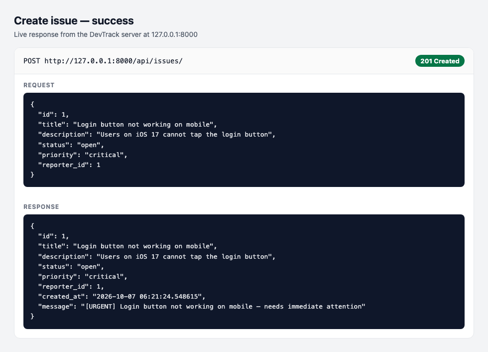
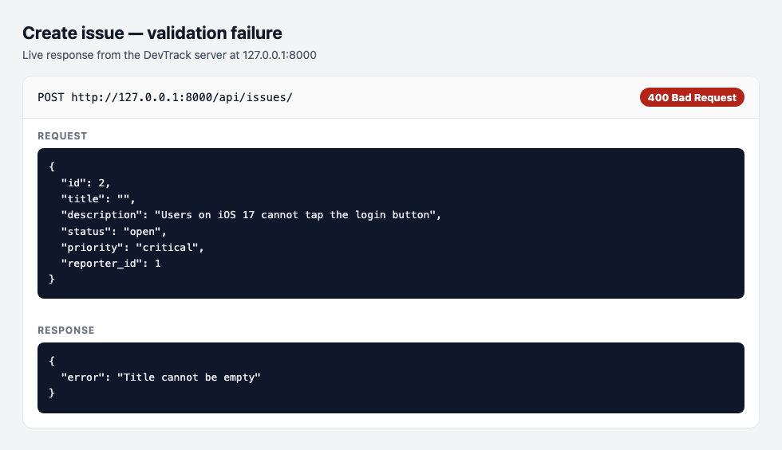

# DevTrack

DevTrack is a small Django API for tracking engineering issues. A reporter files a bug, sets a priority, and the API stores the record in JSON so you can list it, look it up, or filter it by status.

Reporters and issues are Python classes in `issues/models.py`. They are not Django ORM models. `Reporter` and `Issue` inherit from `BaseEntity`, which requires `validate()` and provides `to_dict()`. `CriticalIssue` and `LowPriorityIssue` override `describe()` so a create response can explain the priority in plain language.

## How to run

Python 3.10 or newer is required.

```bash
python3 -m venv .venv
source .venv/bin/activate
pip install -r requirements.txt
python manage.py runserver
```

The API is then available at `http://127.0.0.1:8000`. Data is stored in `reporters.json` and `issues.json` next to `manage.py`. Those files already include three sample reporters and three sample issues.

## Endpoints

Send JSON bodies with `Content-Type: application/json`. POST handlers are CSRF-exempt so Postman can call them without a token. Keep the trailing slash on each URL.

### Reporters

| Method | URL | What it does |
| --- | --- | --- |
| POST | `/api/reporters/` | Create a reporter. Returns `201` and the saved record. |
| GET | `/api/reporters/` | Return every reporter. |
| GET | `/api/reporters/?id=1` | Return one reporter. Returns `404` with `{"error": "Reporter not found"}` when the id is missing. |

Create body:

```json
{
  "id": 1,
  "name": "Ada Lovelace",
  "email": "ada@example.com",
  "team": "backend"
}
```

Validation failures return `400`:

- `{"error": "Name cannot be empty"}`
- `{"error": "Invalid email"}`

### Issues

| Method | URL | What it does |
| --- | --- | --- |
| POST | `/api/issues/` | Create an issue. Returns `201`, the saved fields, and a `message` from `describe()`. |
| GET | `/api/issues/` | Return every issue. |
| GET | `/api/issues/?id=1` | Return one issue. Returns `404` with `{"error": "Issue not found"}` when the id is missing. |
| GET | `/api/issues/?status=open` | Return issues whose status is `open`, `in_progress`, `resolved`, or `closed`. |

Create body:

```json
{
  "id": 1,
  "title": "Login button not working on mobile",
  "description": "Users on iOS 17 cannot tap the login button",
  "status": "open",
  "priority": "critical",
  "reporter_id": 1
}
```

`201` response:

```json
{
  "id": 1,
  "title": "Login button not working on mobile",
  "description": "Users on iOS 17 cannot tap the login button",
  "status": "open",
  "priority": "critical",
  "reporter_id": 1,
  "created_at": "2026-10-07 11:45:00.000000",
  "message": "[URGENT] Login button not working on mobile — needs immediate attention"
}
```

The server sets `created_at` with `str(datetime.now())`. The client does not send it. `message` is only on the create response. It is not stored in `issues.json`.

Priority chooses the class:

- `critical` → `CriticalIssue`, message `[URGENT] {title} — needs immediate attention`
- `low` → `LowPriorityIssue`, message `{title} — low priority, handle when free`
- `medium` or `high` → `Issue`, message `{title} [{priority}]`

Validation failures return `400`:

- `{"error": "Title cannot be empty"}`
- `{"error": "Invalid status"}`
- `{"error": "Invalid priority"}`

Allowed status values are `open`, `in_progress`, `resolved`, and `closed`. Allowed priority values are `low`, `medium`, `high`, and `critical`.

## Design decision

Issue records are stored as JSON objects built by `to_dict()`, and the priority sentence from `describe()` is added only to the HTTP response. The subclass is chosen when the issue is created, then thrown away. What remains on disk is the shared field set (`priority` included), so GET does not need to reconstruct `CriticalIssue` or `LowPriorityIssue` to return a record. The message is derived behavior, not a second copy of the priority.

File paths use Django's `BASE_DIR`, so `reporters.json` and `issues.json` stay next to `manage.py` even if the process is started from another directory.

## Postman

1. Start the server with `python manage.py runserver`.
2. Create a request with method POST and URL `http://127.0.0.1:8000/api/issues/`.
3. Set the body to raw JSON and paste the critical-issue sample above.
4. Send it. A success response is `201` and includes the `[URGENT]` message.
5. Send the same URL again with `"title": ""`. The failure response is `400` and `{"error": "Title cannot be empty"}`.

`runserver` may print a warning about unapplied migrations. DevTrack stores records in JSON files, so you do not need to run `migrate`.

Screenshots of one success (`201`) and one failure (`400`) for `POST /api/issues/`:




